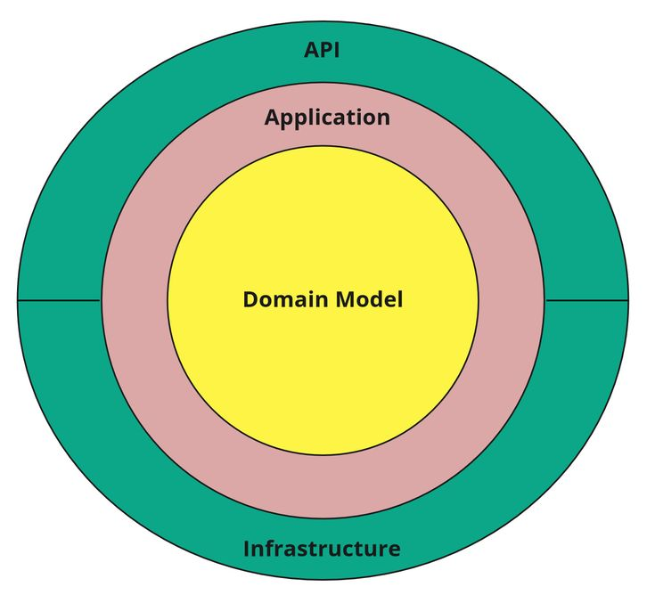
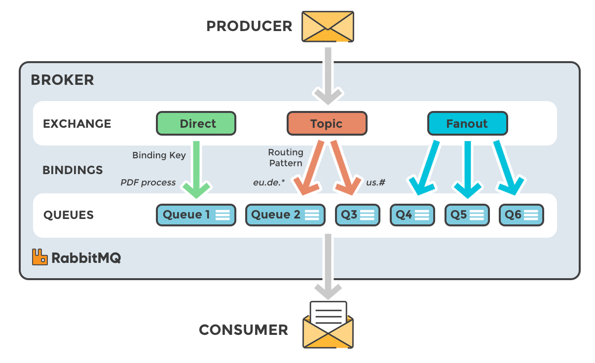

# Clean-Arch-DDD

## Características

- **.NET 8:** El proyecto está construido sobre la plataforma .NET 8, aprovechando las últimas mejoras de rendimiento y funcionalidad.

- **Arquitectura Limpia con DDD:** Sigue los principios de **Clean Architecture** y **Domain-Driven Design (DDD)**, promoviendo una separación clara de responsabilidades, testabilidad y escalabilidad. Las capas se estructuran en `Domain`, `Application`, `Infrastructure` y `WebAPI`.

- **Autenticación con JWT:** Se implementa autenticación basada en JSON Web Tokens (JWT), lo que permite proteger endpoints y asegurar que solo usuarios autenticados puedan acceder a recursos sensibles.

- **Mensajería con RabbitMQ:** La aplicación incluye integración con **RabbitMQ** para una comunicación asincrónica y desacoplada entre componentes mediante colas de mensajes. Se usan exchanges personalizados y políticas de reconexión resilientes.

- **FluentValidation:** Se emplea FluentValidation para validar las entradas en la capa de aplicación, garantizando que los datos sean coherentes antes de ser procesados.

- **AutoMapper:** Se utiliza AutoMapper para simplificar el mapeo entre entidades de dominio, DTOs y comandos/consultas, reduciendo el código repetitivo y facilitando el mantenimiento.

- **Modelo de respuesta genérico:** Todas las respuestas de la API siguen un esquema estandarizado del tipo `{ Success, Data, Message }` mediante un modelo genérico (`ApiResponse<T>`), lo que facilita el consumo desde frontends y la documentación Swagger.

- **Unit of Work y Repositorio Genérico:** Para operaciones de escritura, se implementa un patrón de Unit of Work junto con un repositorio genérico, lo que asegura la integridad transaccional y promueve la reutilización de código.

- **Logging y Manejo de Errores:** Se utiliza un middleware global para capturar y registrar excepciones, junto con políticas de resiliencia para servicios externos como RabbitMQ.

 

## Cómo Empezar

Para comenzar con este proyecto, sigue estos pasos:

1. Clona el repositorio en tu máquina local (ejecutar los siguientes comandos en cmd o powershell):
    
```bash
git clone https://xxxx/Clean-Arch-DDD.git
cd CleanArch
```

2. Abre la solución en tu IDE preferido (Visual Studio, Visual Studio Code, etc.).

3. Configura la conexión a la base de datos en el archivo `appsettings.json` (Por defecto usa localdb no es necesario cambiar la cadena de conexion).

4. Compila y ejecuta la aplicación.

5. Accede a los endpoints de la API mediante la documentación generada por Swagger/GraphQL o tu cliente de API preferido.

## Endpoints de la API

Algunos de los endpoints clave son:

- **POST /product:** Crea una nuevo producto.
- **GET /product/{id}:** Obtiene un producto específico por su ID.
- **GET /product:** Obtiene todos los productos.
- **PUT /product/{id}:** Actualiza un producto existente.
- **DELETE /product/{id}:** Elimina un producto.

Para ver la lista completa de endpoints y sus descripciones, consulta la documentación de Swagger.

## ORM

- Esta plantilla por defecto usa Entity Framework Core, que es el ORM por defecto en dotnet core y el que Microsoft recomienda, pero la pantilla tambien funciona con SQLConnection usando Dapper para soportar Stores Procedures 
- Las migraciones estan configuradas de forma automatica, no se necesita hacer un Update-Database manualmente
- La app esta dockerizada se requiere docker desktop para usar el proyecto o sino iniciar como https
  

## Acceder a API (usuarios)

 - Se agrego auth validation de ejemplo solo a los metodos Usuario se usa la libreria BCrypt SOLO como ejemplo para hashear los password, en un caso real la compañia o cliente deberia estar usando otro tipo de hasheo como Identity o SQLEncrypt
 - El default user para generar un token, se debera consultar el metodo /login, swagger se encuentra configurado en api para consultas a los endpoins asi como para setear bearer tokens

```bash
username: admin
password: Admin123!
```
## Unit Test

- Solo se agrego unit test como ejemplo mostrando como usar NSubstitute y EntityFramework InMemoryDatabase, en realidad se deberia probar TODOS los metodos pero ya que este es un ejemplo solo se probo algunos, debido a esto el score en el code coverage report sera bajo

## Code Coverage

 - Ejecutar los siguientes commandos para crear el code coverage report reemplazar el guid y ruta

```bash
dotnet tool install -g dotnet-reportgenerator-globaltool

dotnet tool install --global coverlet.console

dotnet test --collect:"XPlat Code Coverage"

reportgenerator -reports:"C:\GIT\CleanArch-Docker\Application.Tests\TestResults\3b86fa8b-96e6-4cee-8dd0-2fc5ecdb4ab3\coverage.cobertura.xml" -targetdir:"C:\GIT\CleanArch-Docker\coveragereport_Application" -reporttypes:Html

reportgenerator -reports:"C:\GIT\CleanArch-Docker\Infrastructure.Tests\TestResults\51373deb-27ef-4316-ba92-ba97ce747358\coverage.cobertura.xml" -targetdir:"C:\GIT\CleanArch-Docker\coveragereport_Infrastructure" -reporttypes:Html
```

## RabbitMQ

 - Instalar DockerDesktop y ejecutar el siguiente commando en la consola
 - Por defecto rabbitmq esta deshabilitado se debe cambiar el flag Enabled en el appsettings.json
 
 ```bash
 docker run -d --hostname rmq --name rabbitmq -p 5672:5672 -p 15672:15672 rabbitmq:3-management
 ```
 
 - Accesos RabbitMQ Panel; Usuario: guest / Password: guest
 
 - Por defecto el broker viene configurado como "Direct" pero la pantilla soporta "Topic" y "Fanout" se debe editar las clases encontradas en Infraestructure->Messaging.
 
 
